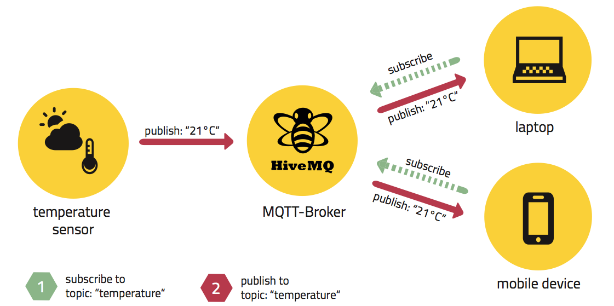
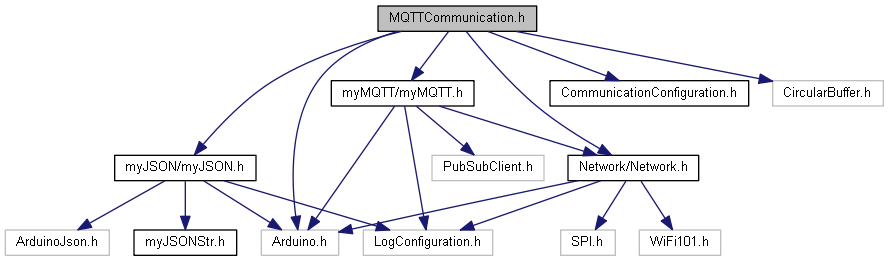
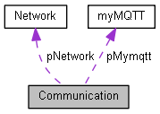

# SmartFactory_MQTTCommunication

The SmartFactroy_MQTTCommunication is an modular part of the SmartFactory project.  
MQTTCommunication establishes a WLAN-connection and allows you to connect  
with an MQTT-Broker to send and receive message.  
Incomming messages need to be in a known JSON-format and will be converted into a struct.  
These messages-structs are stored in a circular-buffer.

<!-- add Pagebreak in Print: <div style="page-break-after: always;"></div> -->

## Table of contents
<!-- TOC Generated with https://magnetikonline.github.io/markdown-toc-generate/ -->

- [The SmartFactory project](#the-smartfactory-project)
- [Tools and technologies](#tools-and-technologies)
	- [Doxygen](#doxygen)
	- [VSCode PlatformIO](#vscode-platformio)
	- [MQTT](#mqtt)
	- [Circular buffer](#circular-buffer)
- [Documentation](#documentation)
	- [Hardware](#hardware)
	- [Software](#software)
		- [Dependency graph](#dependency-graph)
		- [Collaboration diagram](#collaboration-diagram)
		- [Important functions and files](#important-functions-and-files)
			- [MQTTCommunication.h](#mqttcommunicationh)
			- [CommunicationConfiguration.h](#communicationconfigurationh)
			- [myJSONStr.h](#myjsonstrh)
- [FAQ's](#faqs)
	- [I'd like to use this code in my project. What do I need to know?](#id-like-to-use-this-code-in-my-project-what-do-i-need-to-know)
	- [Where can I change the configurations like MQTT-Broker IP and WLAN-Credentials?](#where-can-i-change-the-configurations-like-mqtt-broker-ip-and-wlan-credentials)
	- [I'd like to change the incoming JSON-Message. How can I do that?](#id-like-to-change-the-incoming-json-message-how-can-i-do-that)
- [ToDo's](#todos)
- [Contributors](#contributors)
- [Changelog](#changelog)
- [License](#license)


<div style="page-break-after: always;"></div>

## The SmartFactory project

[SmartFactory_MQTTCommunication](https://github.com/LMazzole/SmartFactory_MQTTCommunication) is part of the SmartFactory-project. It provides a library with basic MQTT-Communication functions.

Other SmartFactory-components are:
* [SmartFactory_Box-Sortic](<https://github.com/LMazzole/SmartFactory_Box-Sortic>)

A possible implementation of the SmartFactory-project can be seen in the Sortic-showcase:

<p align="center"></p>

The associated  repositorys are:  
  [SmartFactory-Sortic](https://github.com/LMazzole/SmartFactory-Sortic)  
  [SmartFactory_Box-Sortic](https://github.com/LMazzole/SmartFactory_Box-Sortic)  
  [SmartFactory_Vehicle-Sortic](https://github.com/LMazzole/SmartFactory_Vehicle-Sortic)  
  [SmartFactory_Vehicle-Basis](https://github.com/LMazzole/SmartFactory_Vehicle-Basis)  
  [SmartFactory_MQTTCommunication](https://github.com/LMazzole/SmartFactory_MQTTCommunication)  

<div style="page-break-after: always;"></div>

## Tools and technologies

The Source-code is written in C++.
To achieve this project, the following tools and technologies were used.

### Doxygen
Doxygen is used for the documentation of the source code.  
An intorduction to *Doxygen* and how to install it can be found in the [ArdFSM-Repo](https://github.com/LMazzole/ArdFSM#documentation-with-doxygen).  

### VSCode PlatformIO
The used IDE is [VSCode](https://code.visualstudio.com/) with the [PlatformIO](https://platformio.org/platformio-ide)-extension.

### MQTT
MQTT (Message Queuing Telemetry Transport) is a lightweight publish-subscribe messaging protocol and requires a broker to relay the messages. It's used for M2M (machine-to-machine) communication.  
An MQTT-system always consist of a broker and one or multiple clients, which can be either subscriber or publisher. 

<p align="center"></p> 

[Image: [MQTT101 - Eclispe Foundation](<https://www.eclipse.org/community/eclipse_newsletter/2014/october/article2.php>)]

A client can subscribe and publish to one or multiple topics. Topics are organized in a tree similar to a folder-structure in Windows. Here's an example of how such a topic-tree and published message can look like:

<p align="center"></p>

This images also illustrates the scalability of MQTT appropriately.  
For more Infos about MQTT and MQTT-topics check out the MQTT-Wiki on [Github](https://github.com/mqtt/mqtt.github.io/wiki).   
[Source: [Wiki:MQTT](https://en.wikipedia.org/wiki/MQTT), [MQTT](https://mqtt.org/) ]  

<div style="page-break-after: always;"></div>

### Circular buffer
A circular buffer or a ring-buffer uses an buffer with fixed Size. If the buffer is full the oldest element gets overwritten.

<p align="center">
    <a href=https://en.wikipedia.org/wiki/Circular_buffer>
        
    </a>
</p>

[Image: [Wiki: Circular buffer](https://en.wikipedia.org/wiki/Circular_buffer)]

<div style="page-break-after: always;"></div>

# Documentation
## Hardware
This code needs a WLAN-shield to function properly.  
It's tested with a [Adafruit Feather M0 WiFi - ATSAMD21 + ATWINC1500](https://www.adafruit.com/product/3010) from Adafruit.

## Software
All functions and files are documented on the [GitHub-Page with Doxygen](https://lmazzole.github.io/SmartFactory_MQTTCommunication/)

### Dependency graph

<p align="center">
    <a href=https://lmazzole.github.io/SmartFactory_MQTTCommunication/_m_q_t_t_communication_8h.html>
        
    </a>
    <p align="center"><small>Click on the image to open doxygen-documentation.</p>
</p>

External libraries:  
* [PubSubClient](https://pubsubclient.knolleary.net/)
* [WiFi101](https://www.arduino.cc/en/Reference/WiFi101)
* [ArduinoJson](https://arduinojson.org/)
* [CircularBuffer](https://github.com/rlogiacco/CircularBuffer)

### Collaboration diagram

<p align="center">
    <a href=https://lmazzole.github.io/SmartFactory_MQTTCommunication/class_communication.html>
        
    </a>
    <p align="center"><small>Click on the image to open doxygen-documentation.</p>
</p>

<div style="page-break-after: always;"></div>

### Important functions and files

#### MQTTCommunication.h  
The *MQTTCommunication.h*-file serves as interface.
It provides the functions for:
* Network-connection
* MQTT-functionalities
* access the message-storage (circular buffer)

#### CommunicationConfiguration.h
In the *CommunicationConfiguration.h*-file are all important settings defined:
* WLAN SSID
* WLAN password
* WLAN Shield pins
* MQTT Broker IP
* JSON parse size
* Cirrcular Buffer size

#### myJSONStr.h
In the *myJSONStr.h*-file is defined how the JSON-message and hence the struct looks like.

This is how the JSON-message (received as String) can look like:
``` javascript
{
  "id": "hostname",
  "topic": "topic/topic",
  "status": "driving",
  "sector": "transit",
  "line": 1,
  "ack":"hostname",
  "req":"hostname",
  "cargo":"beer",
  "token":false;
  "error":false
}
```
And the corresponding struct in which the message gets parsed:
``` cpp
struct myJSONStr {
    String id = "hostname";
    String topic = "topic/topic";
    String status = "driving";
    String sector = "transit";
    int line = 1;
    String ack = "hostname";
    String req = "hostname";
    String cargo = "beer";
    bool token = false;
    bool error = false;
};
```

<div style="page-break-after: always;"></div>

# FAQ's
#### I'd like to use this code in my project. What do I need to know?  
> All you need to do is add the GitHub-Link to this Repo under *lib_deps* in your platformio.ini File and you're set up. All dependencies are downloaded automatic.

#### Where can I change the configurations like MQTT-Broker IP and WLAN-Credentials?  
> All the Configuration data is stored in the *CommunicationConfiguration.h* file and can be edited there.

#### I'd like to change the incoming JSON-Message. How can I do that?  
> Incoming messages need to be in a know JSON-Format which is defined in* myJSONStr.h* and needs to match the implementation in *myJSON::parsingJSONToStruct*. If you would like to change this format you need to adapt both files.


# ToDo's
The open ToDo's can be found in the Documentation on the [GitHub-Page](https://lmazzole.github.io/SmartFactory_MQTTCommunication/todo.html)
- [ ] Split the code in 2 repos: MQTTCommunication-Sortic and MQTTCommunication in order to increase reusability.

# Contributors
- [Luca Mazzoleni](https://github.com/LMazzole)
- Luciano Bettinaglio

# Changelog
V 1.0	-	Release BA FS19	-	[Luca Mazzoleni](https://github.com/LMazzole)

# License

MIT License
